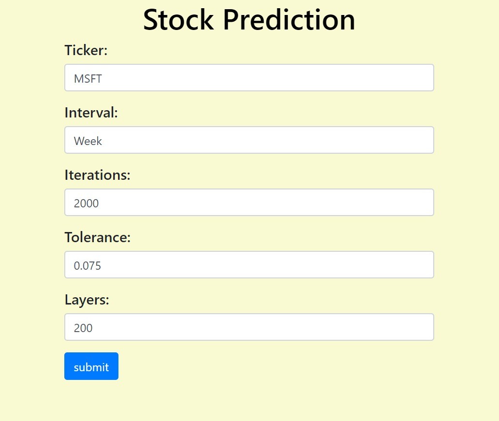
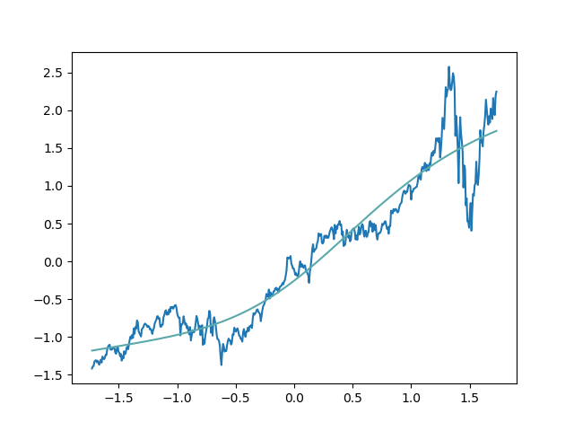

# Stock Ticker Prediction
## Description
Web application that predicts how much a stock will cost in a given estimated time by the user. For instance, if the user wanted to predict how much an Apple stock would be tomorrow, we would use a  prediction model to do that.

## Roles and Accomplishments
### Yeury and Hennjer
We worked on developing the front-end application.
  - Front-end technologies used: HTML5, CSS3, Bootstrap

### Yeury
I worked on connecting the front-end with the back-end using Flask (a python web framework).
  - I was able to get the data and send it to Phidias who handled creating the models for our predictions.

### Phidias
I worked on the model prediction algorithm using Tensorflow.
  - I was able to get the Flask data to create a graph and send it as a response.

## Pre-requisites
1. First, make sure you have Anaconda installed on your machine and make sure you add Anaconda to your operating systems path. If you need assistance on that, [this article](https://www.geeksforgeeks.org/how-to-setup-anaconda-path-to-environment-variable/) is a great resource on how to run Anaconda and how to use it's environments.
2. Second, make sure you have the project cloned on your machine and you create an anaconda environment for this project. Then, we install the required modules for the project.
```
conda create -n stock-prediction python=3.7.3
conda activate stock-prediction
pip install -r requirements.txt
```
3. Run app.py and go to the URL the program provides. It should be http://127.0.0.1:5000/.
```
python app.py
```

## How To Use

To use this program you will need to put in the appropriate information into the form.

Ticker: the ticker name of the stock you want to predict. For example: FB (Facebook), AAPL (Apple), MSFT (Microsoft), and etc.

Interval: the interval the data is created on. The data we obtain is from Yahoo Finances. We use intervals from Day, Week or Month in order to see obtain our data over a 2 year period. When you put in an option, please use Day, Week, or Month as the respective options.

Iterations: the amount of repeated iterations we train our model on. It has a range of 1-3000 to make sure your computer doesn't crash.

Tolerance: the amount of tolerant data we can permit. The closer to 0, the better. It has a range of 0.005-0.800.

Layers: the amount of hidden layers the artificial neural network is using to create it's prediction. It has a range of 1-500 to make sure your computer doesn't crash.

When you fill out the form, press submit. When you press submit, your machine will take some time for your prediction to run. Give it some time until it gives a graph that looks like so:

